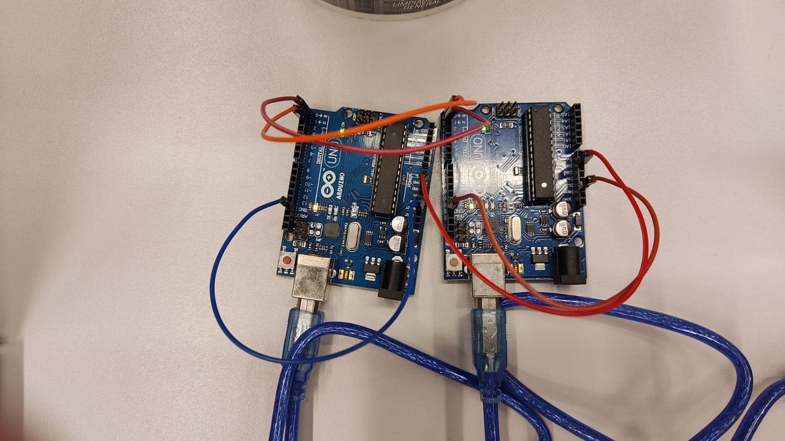

# Projeto 3 de Camada Física da Computação 
## Fragmentação, hand-shake e datagrama

### Autores:
* [Matheus Oliveira](https://github.com/matheus-1618)
* [Nívea Abreu](https://github.com/niveaabreu)

## Descrição:
Implementação de um simulação client-server com envio e recebimento de ações que obedecem uma ordenação temporal real, agora encapsulando o protocolo na forma de um datagrama, que tem em sua constituição três elementos fundamentais:

- HEAD: Tem tamanho fixo de 10 bytes e leva informações importantes a cerca do conteúdo (payload) deste pacote, informando seu tipo, origem, destino, tamanho de dados transportados e afins.

- PAYLOAD: Tem tamanho entre 0 e 114 bytes e transporta uma fração do arquivo total a ser transferido

- EOP: 4 bytes fixos que apresentam o final do datagrama.


Para uma simulação adequada, adotou-se procedimentos para envio protocolar do arquivo:

#### 1- HandShake
Mensagem inicial enviada do client ao server e respondida pelo server ao client, para confirmação de possibilidade de comunicação entre os lados.

#### 2- Fragmentação
Após Handshake permite-se o envio do primeiro pacote (de muitos que foram fragmentados do arquivo a ser enviado) do client ao server.

#### 3- Acknowledge
A cada envio de pacote o server deve conferir se o pacote está de acordo com o especificado no HEAD (tamanho, sucessividade do pacote e etc) e assim informar ao client se está pronto para envio do próximo pacote, ou pedindo um reenvio de um determinado pacote que possa ter vindo a se perder ou corromper durante transmissão.

## Simulação
Foram simulados três tipos de casos:
- SUCESSO DE TRANSMISSÃO: Envia o arquivo de forma adequada, confirmando o recebimento de Acknowledges e mantendo conexão com servidor a todo tempo.

- TIMEOUT: Client não recebe resposta do handshake do Server e pergunta ao usuário se ele deseja tentar o envio novamente, persistindo até que a conexão seja estabelecida ou finalizada.

- ERRO DE TRANSMISSÃO DE PACOTE: Client envia um pacote não correspondente ao esperado pelo server (em termos de sucessividade), e dessa forma o Server reaje parando momentaneamente a a recepção enviando um acknowledge ao Client solicitando o reenvio do pacote desejado; o client então reenvia o pacote e a transmissão retorna de onde parou.

- ERRO DE TRANSMISSÃO DE PAYLOAD: Client envia um pacote com tamanho de payload não correspondente ao esperado pelo server (maior ou menor ao lido pelo RX), e dessa forma o Server reaje parando momentaneamente a a recepção enviando um acknowledge ao Client solicitando o reenvio do pacote desejado; o client então reenvia o pacote e a transmissão retorna de onde parou.


## Montagem

Para montagem, use dois Arduinos uno e 5 jumpers, para ligar os terminais TX e RX cruzado de cada Arduino, e depois conecte cada arduino a um computador (ou ao mesmo se for caso, mas em portas diferentes).
<center></center>

Para realizar a simulação, abra um terminal na pasta server e execute o comando abaixo, e selecione o caso a ser simulado:

```console
 borg@borg:~ python aplicacao_server.py
```
Simultaneamente, abra outro terminal, em outro computador conectado ao arduino, ou em relação a outra porta no mesmo computador e execute, dentro da pasta client. o comando baixo, dando inicio a transmissão e recebimento dos dados:
```console
 borg@borg:~ python aplicacao_client.py
```

Assim, poderão ser simulados os casos de transmissão e recepção entre computadores ou portas diferentes, garantindo comunicação ou simulando casos de erro.

 <center></center>

 ©Insper, 4° Semestre Engenharia da Computação, Camada Física da Computação.
